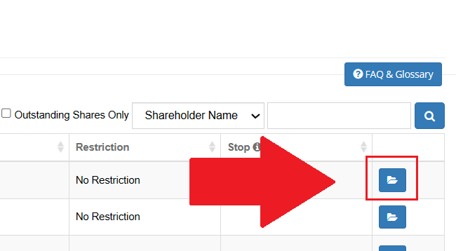
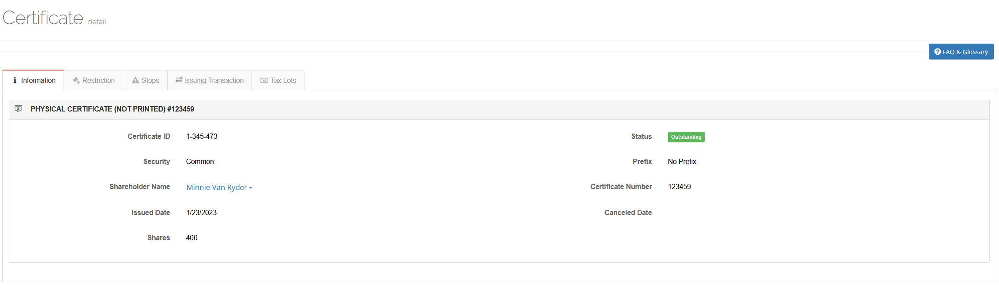
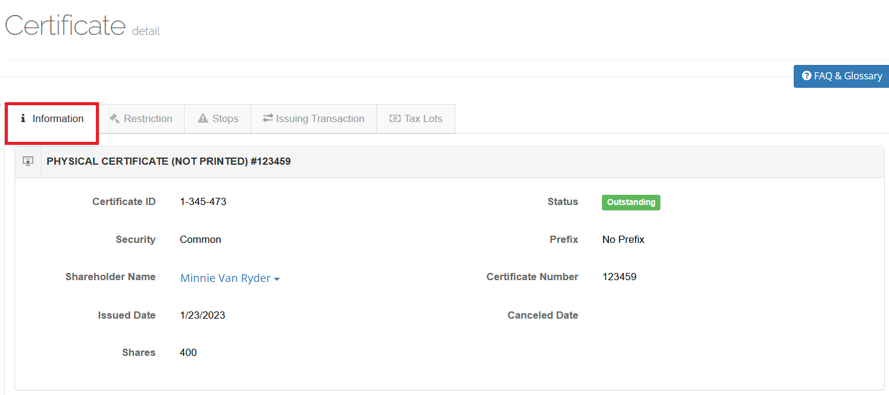
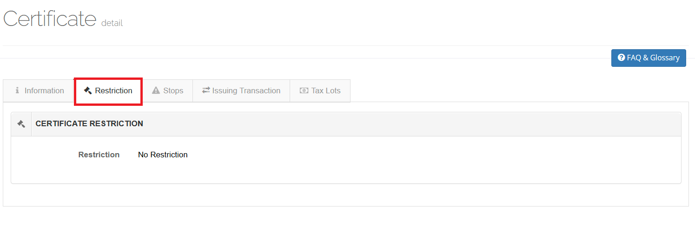
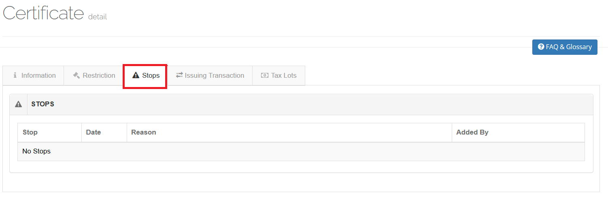
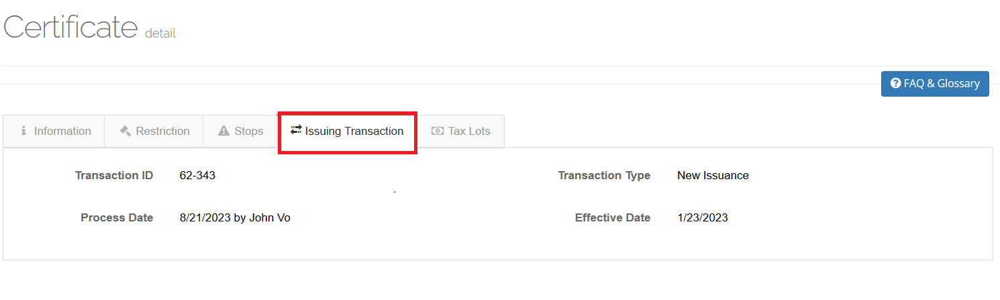
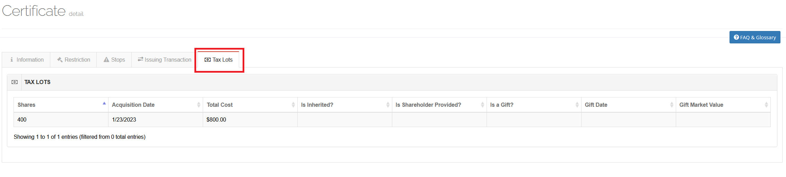

.. only:: latex

   .. raw:: latex

      \clearpage

View Certificate Details
========================

To view the details of a Certificate:

1. Click the ``View Details`` icon in the row that you want to view.

   Certificates, Certificate Lookup, View Details Button.

2. View the details of the Certificate.

   Certificates, Certificate Lookup, Certificate Details.

.. only:: latex

   .. raw:: latex

      \clearpage

Information Tab
^^^^^^^^^^^^^^^

The **Information** tab is the default tab that opens when you view the details of a Certificate.

   Certificates, Certificate Lookup, Certificate Details, Information Tab.

| The **Information** tab displays the following information about the Certificate:

- **Certificate ID**: The unique identifier of the Certificate.
- **Certificate Number**: The number of the Certificate.
- **Status**: The status of the Certificate.
- **Prefix**: The prefix of the Certificate.
- **Canceled Date**: The date the Certificate was canceled.
- **Issue Date**: The date the Certificate was issued.
- **Shares**: The number of shares the Certificate represents.
- **Shareholder Name**: The name of the Shareholder.

.. note::

   Clicking the Shareholder's name will take you back to the :ref:`Shareholder Details <view_shareholder_details>` screen

.. only:: latex

   .. raw:: latex

      \clearpage

Restriction Tab
^^^^^^^^^^^^^^^

The **Restriction** tab displays any restrictions that are associated with the Certificate.

   Certificates, Certificate Lookup, Certificate Details, Restriction Tab.

.. note::

   Restricted securities are securities acquired in unregistered, private sales from the issuer or from an affiliate of the issuer.
   Investors typically receive restricted securities through:

   - private placement offerings,
   - Regulation D offerings,
   - employee stock benefit plans, as compensation for professional services, or
   - in exchange for providing "seed money" or start-up capital to the company. Rule 144(a)(3) identifies what sales produce restricted securities.

.. note::

   If you acquire restricted securities, you almost always will receive a certificate stamped with a "restricted" legend.

.. only:: latex

   .. raw:: latex

      \clearpage

Stops Tab
^^^^^^^^^

The **Stops** tab displays any stops that are associated with the Certificate.

   Certificates, Certificate Lookup, Certificate Details, Stops Tab.

.. note::

   Share certificates may appear as ‘stopped’ if they have been issued in error, or if the shares are involved in current litigation procedures.

Issuing Transaction Tab
^^^^^^^^^^^^^^^^^^^^^^^

The **Issuing Transaction** tab displays the transaction that issued the Certificate.

   Certificates, Certificate Lookup, Certificate Details, Issuing Transaction Tab.

This screen displays the following information about the issuing transaction:

- **Transaction ID**: Unique identifier of the transaction.
- **Transaction Type**: Type of transaction.
- **Effective Date**: Date the transaction was effective.
- **Process Date**: Date the transaction was processed.

Tax Lots Tab
^^^^^^^^^^^^

The *Tax Lots* tab displays information that will help you determine the cost basis of the Certificate.

   Certificates, Certificate Lookup, Certificate Details, Tax Lots Tab.

It displays standard tax lot information, including:

- **Shares** - The number of shares in the tax lot.
- **Acquisition Date** - The cost basis of the tax lot.
- **Total Cost** - The total cost of the tax lot.

As well as additional information, including:

- **Is Inherited?** - Indicates if the tax lot was inherited.
- **Is Shareholder Provided?** - Indicates if the tax lot was provided by the Shareholder.
- **Is a Gift?** - Indicates if tax lot was a gift.
- **Gift Date** - Date the tax lot was gifted.
- **Gift Market Value** - Market value of gift.

